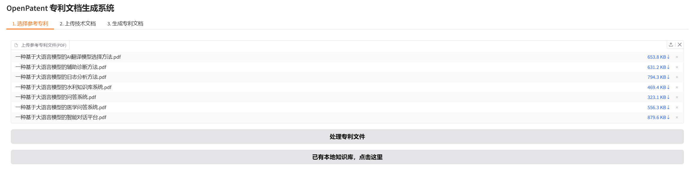
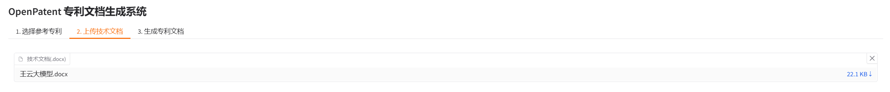
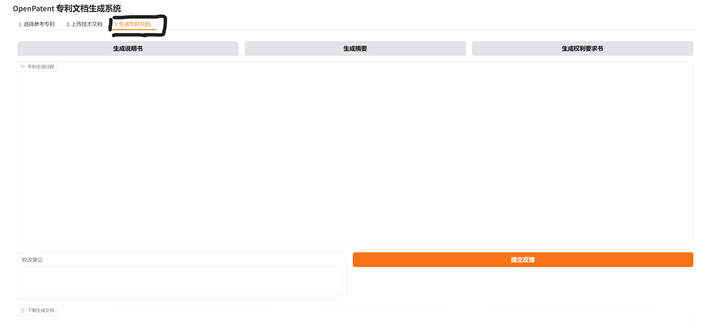
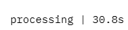
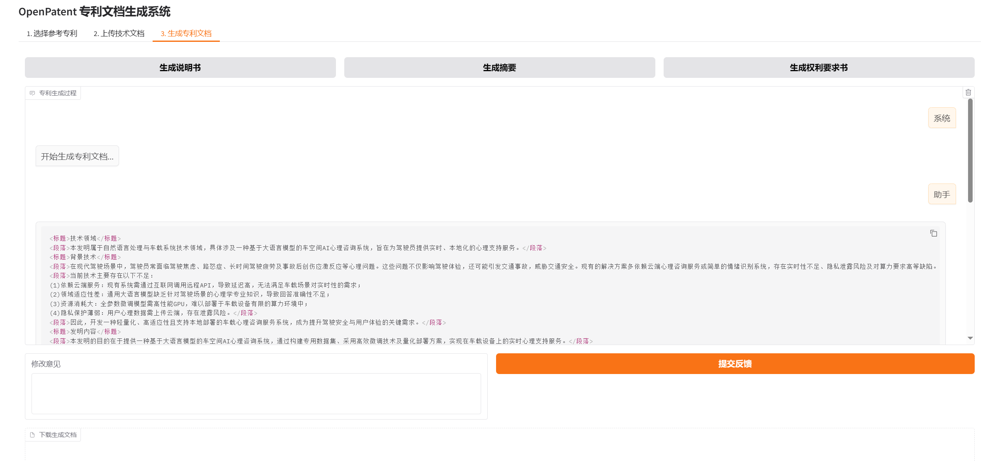
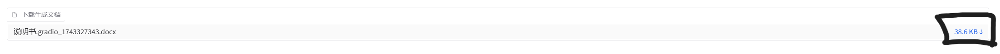

# OpenPatent 专利生成系统

## 简介

OpenPatent 是一个基于大语言模型的专利文档生成系统，旨在帮助用户快速生成高质量的专利文档，包括说明书、摘要和权利要求书。用户通过上传自己已经下载到本地的需要参考的发明专利文件和需要写成专利的技术文档，利用向量数据库检索到与技术文档最相关的内容，并调用大语言模型生成符合专利撰写规范的专利文档。

## 项目来源与本人改进

本项目基于开源项目 [OpenPatent](https://github.com/hengyue-dunhuang/OpenPatent)（作者 hengyue-dunhuang，MIT 协议）进行二次开发与改进。在原项目基础上，本人完成了以下工作：

- **可运行性修复**：解决依赖版本冲突（gradio / fastapi / starlette / huggingface_hub），修复 Windows GBK 控制台崩溃、写死路径等问题，使项目可在新环境稳定运行。
- **配置解耦**：将 LLM 接口配置抽离到环境变量，支持一处切换不同大模型 API（DeepSeek / OpenAI 等）。
- **术语一致性增强**：新增术语表机制，从技术文档抽取关键术语并约束生成，缓解专利各部分间的术语漂移问题。
- **健壮性提升**：为参考专利处理增加单文件容错，损坏文件自动跳过而非整批失败。

详细的环境搭建与改动记录见 [SETUP.md](SETUP.md)。

## 主要功能

*   **参考专利上传与处理：** 用户可以上传参考专利文件（PDF 格式），系统会自动分割文件内容，并建立向量数据库，用于后续的相似内容检索。
*   **技术文档上传：** 用户可以上传技术文档（.docx 格式），作为生成专利文档的基础。
*   **专利文档生成：** 系统支持一键生成专利说明书、摘要和权利要求书。
*   **用户反馈与修订：** 用户可以对生成的文档提供反馈意见，系统会根据反馈内容进行文档修订，直到用户满意为止。
*   **文档保存：** 用户可以将满意的文档保存为 .docx 格式，方便后续编辑和使用。

## 本地部署

### 安装

1.  **克隆代码仓库：**

    ```bash
    git clone https://github.com/lea0518/OpenPatent.git
    cd OpenPatent
    ```
2.  **配置环境变量：**

    在使用 OpenPatent 之前，需要配置以下环境变量：

    *   `open_router_key`：OpenRouter API 密钥 (从 [OpenRouter](https://openrouter.ai/) 获取).
    *   `SILICONFLOW_API_KEY`：SiliconFlow API 密钥 (从 [SiliconFlow](https://siliconflow.cn/) 获取).

    请将这些环境变量添加到您的系统环境变量中。
3.  **安装依赖：**

    在项目根目录下运行以下命令安装所需的 Python 依赖：

    ```bash
    pip install -r requirements.txt
    ```

### 使用

1.  **启动 Web UI：**
    运行 `web_ui.py` 启动 Gradio Web UI：

    ```bash
    python src/web_ui.py
    ```

    在浏览器中打开 Web UI 界面。
2.  **选择参考专利：**
    在 "1. 选择参考专利" 选项卡中，上传参考专利文件（PDF 格式）。点击 "处理专利文件" 按钮，系统会自动处理专利文件，并建立向量数据库。如果已经有本地知识库，可以点击 "已有本地知识库，点击这里" 按钮加载。
3.  **上传技术文档：**
    在 "2. 上传技术文档" 选项卡中，上传技术文档（.docx 格式）。
4.  **生成专利文档：**
    在 "3. 生成专利文档" 选项卡中，点击 "生成说明书"、"生成摘要" 或 "生成权利要求书" 按钮，系统会自动生成相应的专利文档。
5.  **用户反馈与修订：**
    在 "专利生成过程" 区域，查看生成的专利文档。如果需要修改，可以在 "修改意见" 文本框中输入修改意见，然后点击 "提交反馈" 按钮。系统会根据反馈内容进行文档修订。
6.  **文档保存：**
    如果对生成的文档满意，可以在 "修改意见" 文本框中输入 "满意"，然后点击 "提交反馈" 按钮。系统会将文档保存为 .docx 格式。

## 使用教程（图文）

以下是完整的图文使用教程（本项目为本地部署，启动方式见上方「本地部署」）：

1. **访问网站**
   

2. **上传参考专利文件**
   

3. **处理专利文件**
   

4. **上传技术文档（需要用户自己准备一个技术文档，这是生成专利的基础）**
   

5. **切换到生成专利文档标签页（如下图黑框所示）**
   

6. **点击“生成说明书”按钮**
   

7. **等待生成（可能需要两分钟）**
   

8. **查看生成结果**
   

9. **提交修改意见（如果用户满意，则只需要提交“满意”即可，如下图所示）**
   

10. **如果用户提交的反馈为“满意”，则输出一个文档，点击即可下载**
    

11. **下载文档到本地**
    
12. **继续生成摘要和技术文档吧！**
    
13. **生成的文档如下所示**
    
## 许可证

[MIT](LICENSE)
